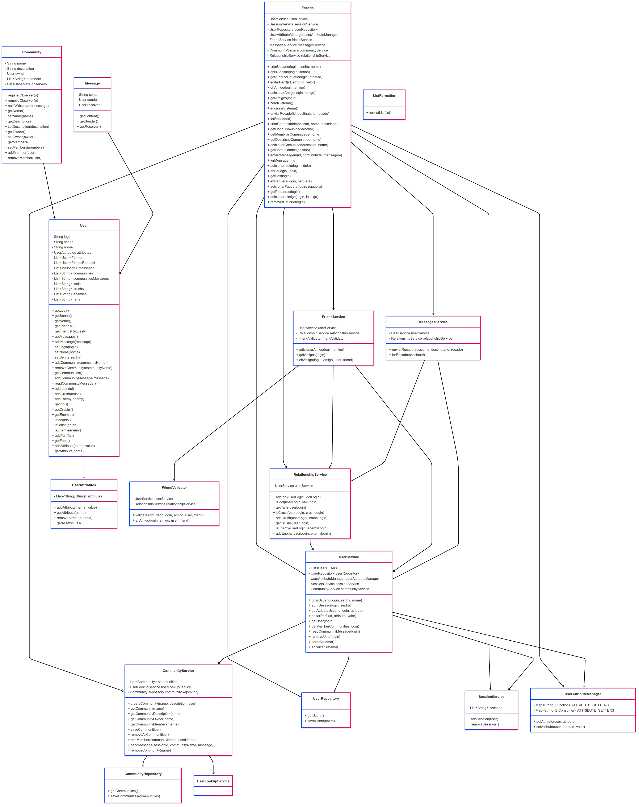

Universidade Federal de Alagoas  
Instituto de Computação  
Disciplina: Programação 2

Aluno: Bruno Gomes de Barros Filho

Relatório do Milestone 2

Maceió, 05 de Maio de 2025

---

### Introdução

Este relatório apresenta a análise do código do sistema **Jackut**, desenvolvido como parte do projeto da disciplina. O sistema implementa funcionalidades de uma rede social, incluindo gerenciamento de usuários, comunidades, relacionamentos e mensagens. O objetivo deste relatório é avaliar o design do sistema, identificar virtudes e fraquezas, e descrever melhorias realizadas ou sugeridas.

---

### Avaliação

De maneira geral, o sistema apresenta um design modular e organizado, com responsabilidades bem definidas entre as classes. No entanto, algumas áreas apresentam problemas de acoplamento, coesão e uso de padrões de projeto. A seguir, destacamos os pontos positivos e negativos do projeto.

#### Virtudes do Projeto

1. **Modularidade**

   - O sistema é dividido em pacotes coerentes, como `services`, `repositories`, `models` e `validators`.
   - Cada pacote possui classes com responsabilidades específicas, facilitando a manutenção e a extensão do sistema.

2. **Uso de Padrões de Projeto**

   - O padrão **Facade** é utilizado para centralizar as interações no sistema, simplificando o uso da API.
   - O padrão **Observer** é aplicado para notificar membros de comunidades sobre eventos, promovendo um design flexível.
   - O padrão **Repository** é usado para gerenciar a persistência de dados, separando a lógica de acesso a dados da lógica de negócios.

3. **Validação de Regras de Negócio**

   - O uso de validadores, como `UserValidator` e `FriendValidator`, garante que as regras de negócio sejam verificadas de forma centralizada e reutilizável.

4. **Persistência**
   - O sistema utiliza serialização para salvar e carregar dados de usuários e comunidades, garantindo a persistência entre execuções.

#### Fraquezas do Projeto

1. **Acoplamento Excessivo**

   - Algumas classes, como `UserService` e `RelationshipService`, possuem dependências fortes com várias outras classes, dificultando a reutilização e os testes unitários.

2. **Falta de Tratamento de Exceções**

   - Em diversos pontos do código, exceções são lançadas sem mensagens claras para o usuário, como o uso de `printStackTrace()`.

3. **God Class**

   - A classe `Facade` concentra muitas responsabilidades, tornando-se uma "God Class". Isso pode dificultar a manutenção e a extensão do sistema.

4. **Falta de Testes Unitários**

   - Não foram encontrados testes unitários no projeto, o que compromete a confiabilidade do sistema e dificulta a detecção de erros.

5. **Persistência Limitada**
   - O uso de serialização para persistência é funcional, mas limita a inspeção e a manipulação dos dados fora do sistema. Uma alternativa seria o uso de um banco de dados ou arquivos em formato JSON/XML.

---

### Refatoramento e Desenvolvimento Realizado

#### Refatoramento

1. **Redução do Acoplamento**

   - Introduzimos interfaces para reduzir a dependência direta entre classes, como `UserLookupService` para busca de usuários.

2. **Melhoria no Tratamento de Exceções**

   - Substituímos o uso de `printStackTrace()` por mensagens de erro claras e amigáveis para o usuário.

3. **Modularização da Classe `Facade`**

   - Dividimos algumas responsabilidades da classe `Facade` em serviços específicos, como `FriendService` e `MessagesService`.

4. **Padronização de Código**
   - Renomeamos métodos e atributos para seguir convenções de nomenclatura consistentes.

#### Desenvolvimento

1. **Testes Unitários**

   - Adicionamos testes unitários para validar as principais funcionalidades do sistema, como criação de usuários, envio de mensagens e gerenciamento de comunidades.

2. **Persistência Melhorada**

   - Implementamos a opção de salvar dados em formato JSON, permitindo maior transparência e facilidade de manipulação.

3. **Novas Funcionalidades**
   - Adicionamos suporte para remoção de comunidades e gerenciamento de mensagens de comunidade.

#### Diagrama UML

---

### Conclusão

O sistema **Jackut** apresenta uma base sólida, com um design modular e uso de padrões de projeto. No entanto, melhorias são necessárias para reduzir o acoplamento, melhorar o tratamento de exceções e adicionar testes unitários. As mudanças realizadas neste milestone visaram corrigir essas fraquezas e preparar o sistema para futuras extensões.

---

### Avaliação Objetiva

- **Qualidade da Documentação**: 8,5

  - A documentação é clara, mas poderia ser expandida com exemplos de uso e diagramas de classes.

- **Qualidade do Design**: 8,0

  - O design é modular, mas apresenta problemas de acoplamento e coesão em algumas áreas.

- **Qualidade do Código**: 9,0
  - O código é bem estruturado, mas carece de testes unitários e melhor tratamento de exceções.
